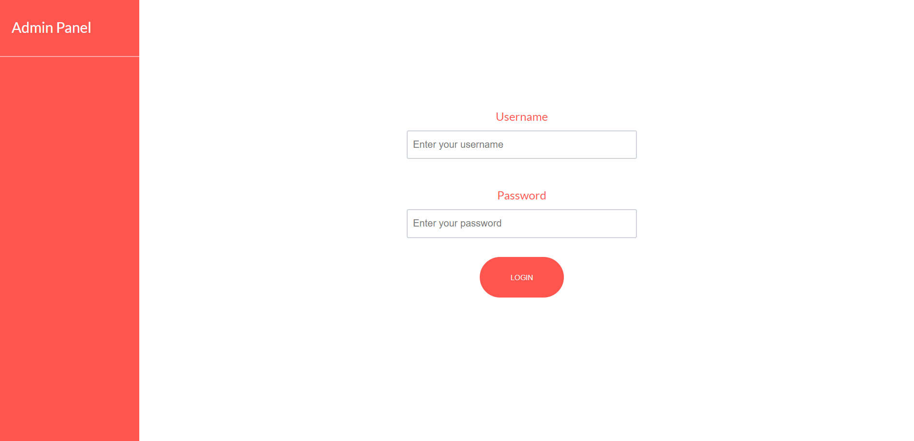
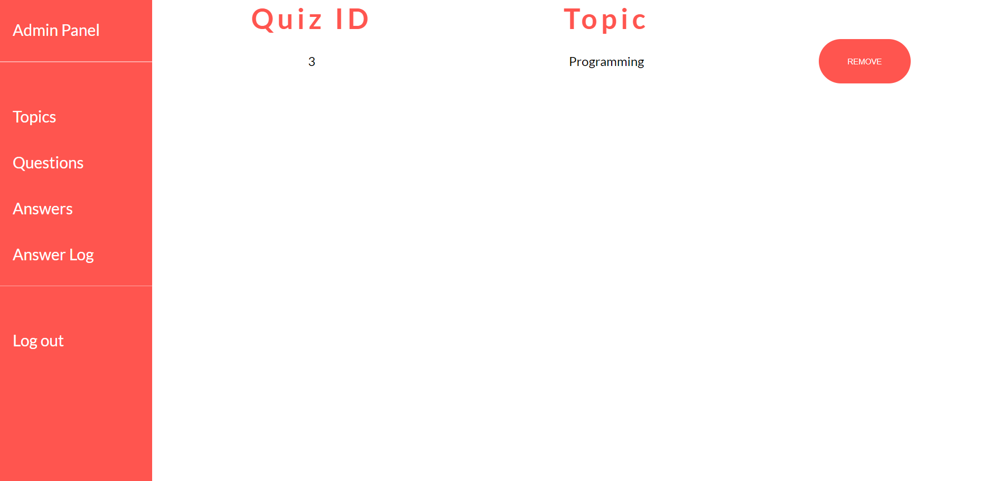

# Quiz

Simple quiz where user enters his name, picks a topic, gives the answers and finally gets the results.

## Prerequisites

* Git
* VirtualBox
* Vagrant
* Homestead
* Node Package Manager

## Setup

* Clone this repository on your computer

* Setup local Vagrant Homestead server

* Import quizzes.sql database in to your project

* Change the necessary parameters in public/config.php

* Install required npm and composer dependencies

## Pictures

## Author

* **Ričards Lazda** - [Ričards Lazda](https://github.com/ricardslazda)

